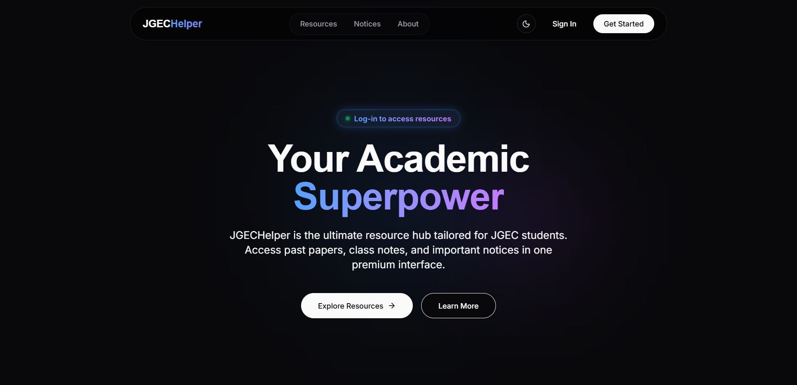

# JGECHelper

**Live Demo:** https://jgechelper-web.vercel.app

JGECHelper is an academic resource hub designed specifically for students to share and manage educational materials easily and securely.

## 📸 Screenshot



## 🚀 Key Features

- **Secure Authentication:** Firebase authentication with mandatory branch onboarding.
- **Resource Management:** Secure file uploads, previews, and hard-deletion.
- **Admin Dashboard:** Tools for user management and platform moderation.
- **Modern UI/UX:** Dark-first design with physics-based hover effects, animations, and optional theme switching.
- **Type-Safe API:** Next.js App Router API endpoints for secure communication.

## 🛠️ Tech Stack

- Next.js 16
- React 19
- Tailwind CSS 4
- Framer Motion
- Firebase
- Vercel Blob

## 📁 Project Structure

```text
web/
├── src/
│   ├── app/           # Next.js App Router pages and API routes
│   │   ├── api/       # Serverless API endpoints 
│   │   ├── login/     # Authentication flows
│   │   ├── register/  # User registration
│   │   └── resources/ # Academic resource browsing
│   ├── components/    # Reusable React components
│   └── lib/           # Utility functions and configuration
├── public/            # Static assets
└── globals.css        # Global styles and theme variables
```

## 📝 License

This project is licensed under the MIT License.
